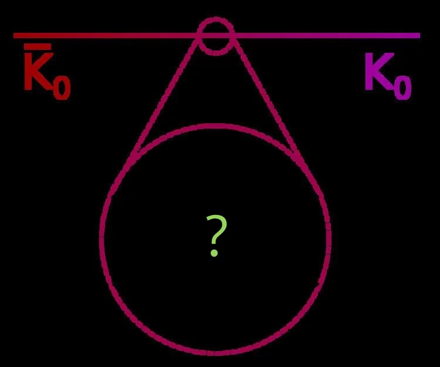

# KaonOscillations_tmLQCD
This repo contains the work of my MSc thesis in theoretical physics. The aim is to evaluate Kaon oscillation matrix elements (i.e. three points correlation functions) throught the insertion of a complete set of 4-quarks dimension-6 operators. This could be useful to derive some parameters connected to BSM physics effects within the K-Kbar oscillations.
References about operators, about the work already done and about tecniques:

### Kaon Mixing and dimension-6 four-quarks operators
- KMBSM https://arxiv.org/abs/1207.1287 *Kaon Mixing Beyond the SM from Nf=2 tmQCD and model independent constraints from the UTA*
- RenRun https://doi.org/10.1140/epjc/s10052-018-6002-y *Non-perturbative renormalisation and running of BSM four-quark operators in Nf=2
 QCD*

See also *Frezzotti, Rossi - Chirally improving Wilson fermions 2. Four-quark operators*

### Simulation features and settings, mixed action, extrapolations and fits
Sea sector:
- Bruno https://arxiv.org/pdf/1411.3982.pdf *Simulation of QCD with Nf = 2 + 1 flavors of non-perturbatively improved Wilson fermions*
- scale_CLS_opt1 https://arxiv.org/pdf/1608.08900.pdf *Setting the scale for the CLS 2 + 1 flavor ensembles*

Both sea and valence:
- tmMixAct https://doi.org/10.1051/epjconf/201817513018 *A tmQCD mixed-action approach to flavour physics*
- LightMesons https://doi.org/10.22323/1.396.0258 *Light meson physics and scale setting from a mixed action with Wilson twisted mass valence quarks*

### Open boundary conditions
Theory:
- OBC_top https://arxiv.org/pdf/1105.4749.pdf *Lattice QCD without topology barriers*
- OBC_tm https://arxiv.org/pdf/1206.2809.pdf *Lattice QCD with open boundary conditions
and twisted-mass reweighting*

Addendum:
- OBC_charmed_opt2 https://arxiv.org/pdf/1701.05502.pdf *Charmed pseudoscalar decay constants on
three-flavour CLS ensembles with open boundaries*
- OBC_continuum_opt3 https://arxiv.org/pdf/1702.01035.pdf *Towards the continuum limit with improved Wilson
fermions employing open boundary conditions*

### Twisted mass theory
- tmLQCD https://arxiv.org/pdf/hep-lat/0101001.pdf *Lattice QCD with a chirally twisted mass term*
- FR1 https://arxiv.org/pdf/hep-lat/0306014.pdf *Chirally improving Wilson fermions I. O(a) improvement*
- FR2 https://arxiv.org/pdf/hep-lat/0407002.pdf *Chirally improving Wilson fermions 2. Four-quark operators*

### O(a) Improvement of Wilson fermions and Schroedinger functional
- Improving_Sommer https://arxiv.org/abs/hep-lat/0611020 *Non-perturbative QCD: renormalization, O(a)-improvement and matching to Heavy Quark Effective Theory*
- Improving_Sint https://arxiv.org/pdf/1008.4857.pdf *The chirally rotated Schrodinger functional with Wilson fermions and automatic O(a) improvement*

---
---

# Repo organization
The simulation codes are into tm-obc-QCD folder. Inside it you can find other README file(s) and documents about the code.

Inside articles_thesis you can find the mentioned above articles and also some useful articles. The ones in the above lists are *mandatory papers* (from the referee M. Papinutto); the rest are additional.

---

### Contacts:
rosiemanuele99@gmail.com, rosi.1812180@studenti.uniroma1.it

